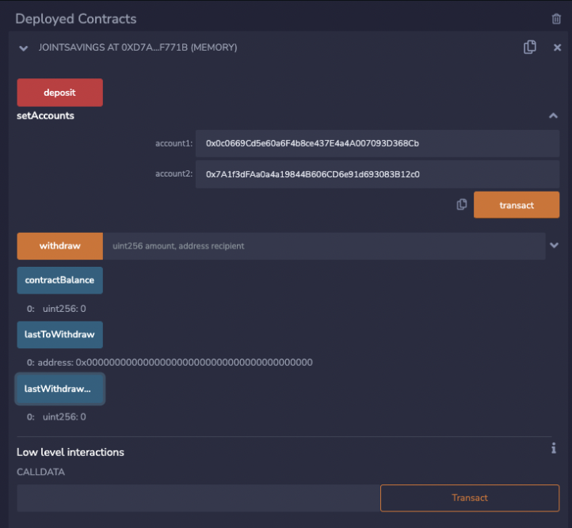
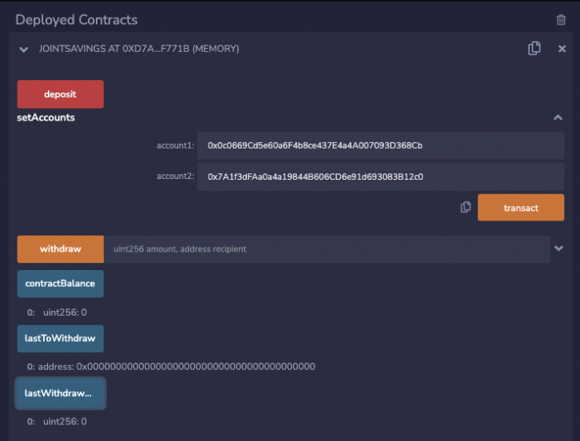
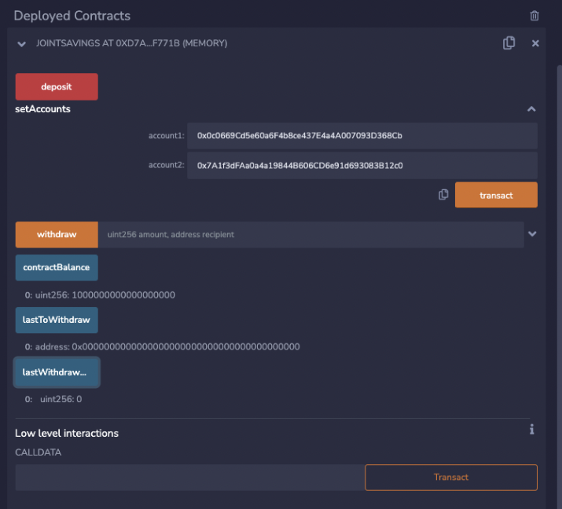
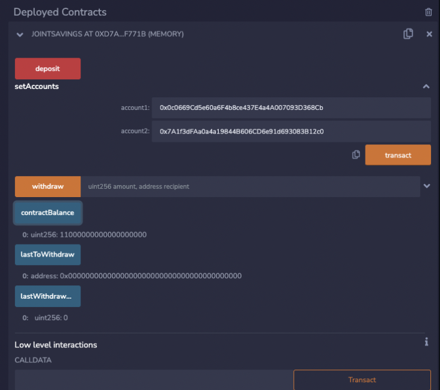
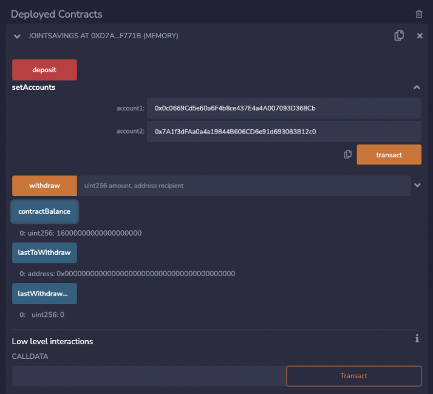
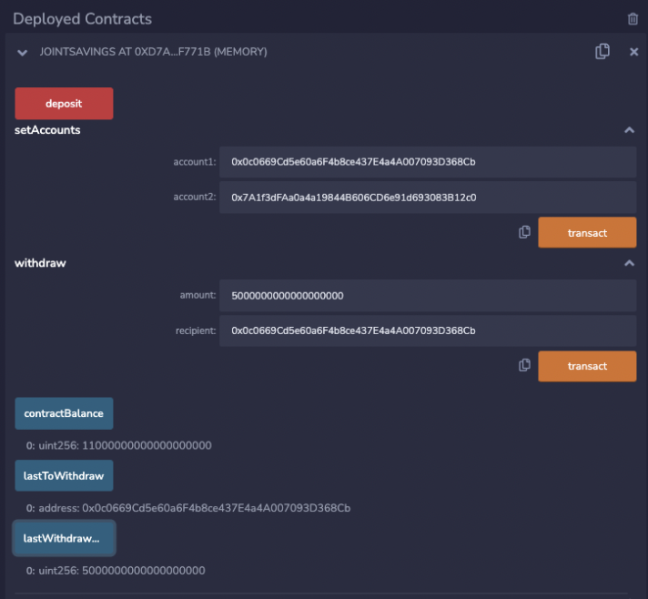
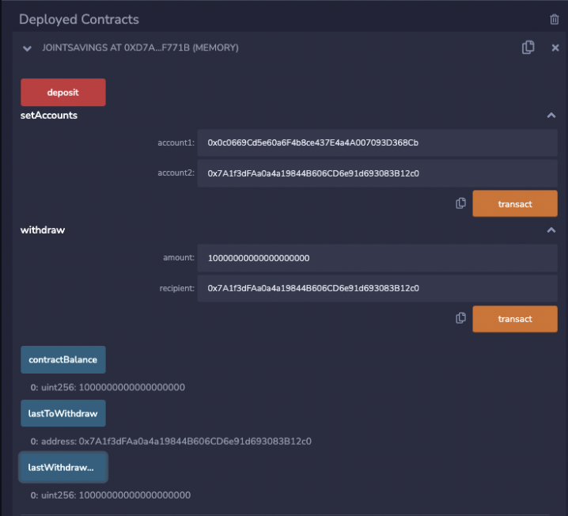

# Joint Savings Accounts using Smart Contracts

This Solidity smart contract automates joint savings accounts between two user addresses. This is achieved through ether management functions which allows financial institution's to implement their required features. It can be used to deposit or withdraw funds. 

## Deploying the contract



### Setup Accounts



### Deposit 1 ether



### Deposit 10 ether



### Deposit 5 ether


### Withdraw 5 ether to Account 1



### Withdraw 10 ether to Account 2




## How to Use

Download or clone project 

Launch Remix using the following URL:

```python
https://remix.ethereum.org/
```
## Contributors
> Email: Henrydate1@gmail.com |
> [GitHub](https://github.com/henrydate) |
> [LinkedIn](https://www.linkedin.com/in/henry-date-9356351a4/)

---


